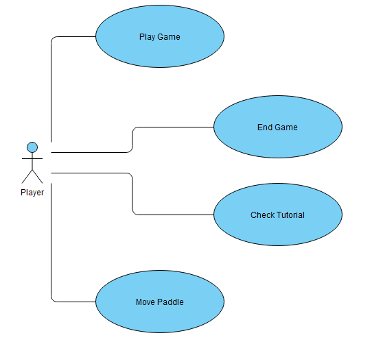

# Hockey-T64:
This is a simple Pong inspired game, themed after hockey tables, created using Pygame.  
## Use Case:   
  
## Installation
1. Clone this repository
2. Install the required dependency pygame
3. Run the main.py file
## Usage
Z, S for PLAYER1 movement  
ARROWUP, ARROWDOWN for PLAYER2 movement
## Contributing
Contributions are welcomed!  
If you would like to contribute to this project, please fork the repository and create a pull request.
## License
All of the content of this project belong to "Karim Bouaouina","Meriam Mghaieth" under the name of "Semestrial Project 2022-2023 Ecole Polytechnique Sousse"
